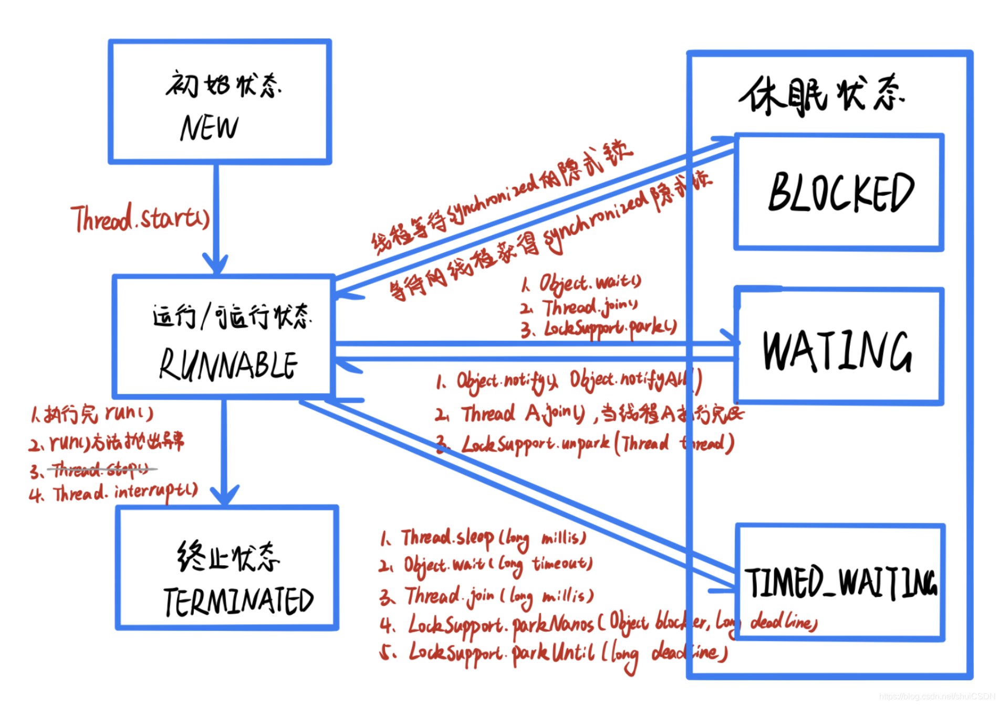

+++
weight = 100
date = "2023-05-03T22:37:22+01:00"
draft = false
author = "SurryChen"
title = "八股文笔记"
# icon = "rocket_launch"
toc = true
description = "记录一些平时遇到的面试八股文知识点"
publishdate = "2023-05-03T22:37:22+01:00"
tags = ["Beginners"]
+++

## Java基础篇
---
### 一、关于`<<`、`>>`、`>>>`的一些举例。
---
#### 1、基础知识
---
>**`<<`** :左移运算符，向左移若干位，高位丢弃，低位补零。`x << 1`,相当于 x 乘以 2(不溢出的情况下)。
>**`>>`** :带符号右移，向右移若干位，高位补符号位，低位丢弃。正数高位补 0，负数高位补 1。`x >> 1`，相当于 x 除以 2。
>**`>>>`** :无符号右移，忽略符号位，空位都以 0 补齐。

#### 2、代码举例
---
**左移运算符：**
```Java
int intNum = 123;  
// 输出结果为1111011
System.out.println(Integer.toBinaryString(intNum));  
intNum <<= 2;
// 输出结果为111101100
System.out.println(Integer.toBinaryString(intNum));
```
**结论：**
>左移两位，因为没有溢出，所以高位不需要丢弃，低位补零

**有符号右移运算符：**
```Java
int posNum = 123213;
// 输出结果为11110000101001101
System.out.println(Integer.toBinaryString(posNum));  
posNum = posNum >> 2;  
// 输出结果为111100001010011
System.out.println(Integer.toBinaryString(posNum));  
  
int negNum = -123213;  
// 输出结果为11111111111111100001111010110011
System.out.println(Integer.toBinaryString(negNum));  
negNum = negNum >> 2;  
// 输出结果为11111111111111111000011110101100
System.out.println(Integer.toBinaryString(negNum));
```
**结论：**

>正数右移两位，因为正数高位补0，所以没有显示出来。
>负数右移两位，因为负数高位补1，所以结果如此。

**无符号右移运算符：**
```Java
int posNum = 123213;  
// 输出结果为11110000101001101
System.out.println(Integer.toBinaryString(posNum));  
posNum = posNum >>> 2;  
// 输出结果为111100001010011
System.out.println(Integer.toBinaryString(posNum));  
  
int negNum = -123213;  
// 输出结果为11111111111111100001111010110011
System.out.println(Integer.toBinaryString(negNum));  
negNum = negNum >>> 2;  
// 输出结果为111111111111111000011110101100
System.out.println(Integer.toBinaryString(negNum));
```
**结论：**
>不考虑符号位，也就是不管正数还是负数，高位都补零

**对比有符号右移与无符号右移运算符**：
>对于正数，有最大值的范围限制之别，因为有符号的最大值为$2^{31}-1$，而无符号的最大值为$2^{32}-1$，其余操作类似
>对于负数，有补位之别，因为有符号是高位用1补位，而无符号没有负数概念，所以都是高位用0补位

### 二、字符串常量池
---
### 1、字符串常量池是什么？
---
>字符串常量池是一个存储字符串常量的内存区域，它由Java虚拟机（JVM）维护。字符串常量池中的字符串是不可变的，因此它们可以被多个类或对象共享。

#### 1.1、为什么要在内存做这么一个东西呢？
---
显然，字符串在程序中使用的非常频繁，如果每次使用都去创建，那么就很消耗内存，既然如此，那么干脆创建一个，一直用，不就好了吗？所以就需要去做了。

#### 1.2、如果不可变的，那"123"+"123"有改变了字符串吗？
---
没有改变。为什么呢？因为"123"+"123"在Java里面，实际上就变成了一个新的字符串了，重新new了一个，而不是原来的改变了。这样也能充分发挥常量池的作用嘛。

### 2、字符串常量池存在于哪里？
---
>前置知识：JVM的运行时数据区包括：JVM栈、堆、方法区、本地方法栈、程序计数器，关于这些概念，可以看[这篇博客](https://blog.csdn.net/m0_67394230/article/details/126723134)

JDK1.7之后，字符串常量池存放到堆中。

### 3、字符串常量池怎么用？
---
>堆里面存放的是对象，指向对象的应用放置在JVM栈中

字符串对象的创建方式分为两种：
+ 直接赋值，包括使用“+”连接（注意：只包括"a" + "b"这种，而不是两个字符串对象通过"+"连接）
+ 创建对象

直接赋值：
+ 如果字符串常量池中存在，则返回字符串常量池中的引用地址
+ 如果字符串常量池中不存在，则先在字符串常量池中创建字符串实例，并返回字符串常量池中的引用

创建对象：
+ 不走字符串常量池，而是像其他对象一样，在堆中创建对象并返回，也不会将这个对象放入字符串常量池，就算字符串常量池里面有这个字符串，也不会返回字符串常量池中的对象引用
+ 调用字符串对象的intern()，可以在字符串常量池中创建对象，并返回字符串常量池的引用

创建对象的代码举例：
```Java
// 第一种情况
String a = new String("123");  
String b = "123";  
// false，说明创建的对象并没有进入字符串常量池
System.out.println(a == b);

// 第二种情况
String a = new String("123").intern();  
String b = "123";  
// true，说明创建的对象进入了字符串常量池
System.out.println(a == b);
```

### 4、字符串常量池有什么好处？
---
请看上面的[1.1](#1.1、为什么要在内存做这么一个东西呢？)。

### 三、深拷贝、浅拷贝与引用拷贝
---
>对象的实际存储是在堆中，对象的引用存储在JVM栈中。引用拷贝就是拷贝一下JVM栈里面的引用；浅拷贝是既拷贝JVM引用，也拷贝堆中的存储内容，但是由于对象里面嵌套的对象，实际在堆中存储的也是引用，其实里面还有这样一层引用拷贝；深拷贝就是全部都拷贝了，包括嵌套的对象。

### 四、BIO、NIO与AIO
---
>BIO是同步阻塞，NIO是同步非阻塞，AIO是异步非阻塞。

####  1、同步与异步、阻塞与非阻塞
---
-   同步&异步：当数据还未处理完成时，代码的逻辑处理方式不同。
-   阻塞&非阻塞：当数据还未处理完成时(未就绪)，线程的状态。

#### 2、理解
---
>同步不会让出时间片，而阻塞会让出时间片。

#### 3、为什么Netty使用的是NIO，却被认为是异步非阻塞？
---
>Netty的异步是基于事件的，使用的是Future，而不是异步IO。

### 五、sleep() 方法和 wait() 方法区别和共同点
---
>任何线程都可以调用sleep()方法进入休眠状态，但是只有获取synchronized隐式锁的线程，才能调用wait()方法（是Object的方法，释放Object的锁，好像也很合理），另外wait()方法主要用于等待/通知机制，除了超时机制，还能通过调用notify()和notifyAll()让线程状态转变为RUNNABLE。

另外一些区别：
1.  调用sleep()方法和带有超时参数的wait()方法，都会让线程状态从RUNNABLE，变为TIMED_WATING。
2.  调用无参的wait()方法，会让线程状态从RUNNABLE变为WATING。


### 六、Runnable和Callable的区别
---
>**Runnable接口**只有一个无返回值的run() 方法。它用于定义一个要在单独线程中执行的任务。当线程执行 run()方法时，它将运行任务，但不会返回任何结果。因此， Runnable接口更适合用于不需要返回结果的简单任务。**Callable接口**也是用于定义可以在单独线程中执行的任务，但是它具有不同的方法签名。它的call()方法可以返回一个值，并且可以抛出异常。因此， Callable接口更适合需要返回结果或可能抛出异常的任务。

代码演示：

```java
import java.util.concurrent.*;

public class Example {

    public static void main(String[] args) throws Exception {
        // Create a thread pool with a single thread
        ExecutorService executor = Executors.newSingleThreadExecutor();
        
        // Define a task using a Runnable
        Runnable task1 = () -> {
            System.out.println("Task 1 is running");
        };
        
        // Define a task using a Callable
        Callable<Integer> task2 = () -> {
            System.out.println("Task 2 is running");
            return 42;
        };
        
        // Submit the tasks to the executor
        Future<?> future1 = executor.submit(task1);
        Future<Integer> future2 = executor.submit(task2);
        
        // Wait for the tasks to complete and print their results
        System.out.println("Result of task 1: " + future1.get()); // Prints "Result of task 1: null"
        System.out.println("Result of task 2: " + future2.get()); // Prints "Result of task 2: 42"
        
        // Shut down the executor
        executor.shutdown();
    }
    
}
```

### 七、关键字synchronized和volatile区别
---
>volatile的作用：保证了并发根源问题中的可见性与顺序性（[参考](java中volatile的作用，volatile保证可见性有序性原理，volatile不保证原子性_旋尘的博客-CSDN博客](https://blog.csdn.net/weixin_47071411/article/details/123625510)）[ )) 。对比：[关键字synchronized和volatile区别以及作用](https://blog.csdn.net/weixin_37519463/article/details/114937411) 。顺序性是指，不会将原本是“先读后写”排序成“先写后读”，也不会将原本是“先写后读”排序成“先读后写”。

### 八、Java线程池
---
>了解原理，就很好理解各个参数的含义。首先是**核心线程数**，可以一直执行而不会被销毁的线程数量，然后是**任务队列**，当核心线程都在执行任务的时候，会把任务存放在任务队列，还有一个是**最大线程数量**，可以创建非核心线程，其执行的任务并非是从任务队列里面取一个，而是，创建的时候，执行当前提交的任务，由于并不是核心线程，所以会被销毁，销毁方式通过**Keep-alive**等待时间指定，超过指定时间没有任务就会被销毁，当所有都满的时候，会出现溢出现象，所以还有**溢出策略**，默认的策略有：拒绝并报错、拒绝但是不报错、拒绝但是让调用者的线程去执行、不拒绝但是把任务队列中的第一个任务丢弃后再提交（自己实现`RejectedExecutionHandler`接口，比如将任务存在数据库或者缓存中，这样就数据库或者缓存中获取到被拒绝掉的任务了）。除了上面以外，还有**定义一个创建线程的工厂**，毕竟一开始线程池里面是没有线程的，可以默认，也可以自定义，自定义就可以命名线程，更好地在日志中查看信息。

### 九、分布式数据库的分片策略
---
>涉及的是数据库的分表与分库，有水平分表、垂直分表、水平分库、垂直分库。其中分片策略主要是解决数据的水平分片问题（数据被水平分片之后，数据究竟该存放在哪个表）。

-   **哈希分片** ：求指定 key（比如 id） 的哈希，然后根据哈希值确定数据应被放置在哪个表中。哈希分片比较适合随机读写的场景，不太适合经常需要范围查询的场景。
-   **范围分片** ：按照特性的范围区间（比如时间区间、ID区间）来分配数据，比如 将 `id` 为 `1~299999` 的记录分到第一个库， `300000~599999` 的分到第二个库。范围分片适合需要经常进行范围查找的场景，不太适合随机读写的场景（数据未被分散，容易出现热点数据的问题）。
-   **地理位置分片** ：很多 NewSQL 数据库都支持地理位置分片算法，也就是根据地理位置（如城市、地域）来分配数据。
-   **融合算法** ：灵活组合多种分片算法，比如将哈希分片和范围分片组合。

### 十、ThreadLocal的实现原理
---
1. ThreadLocal里面并不保存数据，真正保存数据的是Thread里面的变量——ThreadLocal.ThreadLocalMap对象，ThreadLocal仅仅只是提供了对该对象操作的API，因此当线程结束，后续GC的时候就可以被清除，而不是作为静态变量一直存在（ThreadLocal在实际使用中，通常是private static）。
2. 由于一个线程中可能会存在多个ThreadLocal对象，所以Thread中的ThreadLocal.ThreadLocalMap对象使用键值对的方式存储，键是ThreadLocal对象，值是实际存储的值。
3. 关于Entity的弱引用，是为了方便GC，在Entity的引用链中，有两个，一个是ThreadLocal作为键名的引用链，一个是Thread中的ThreadLocal.ThreadLocalMap对象的引用链，所以如果Entity作为弱引用，当线程执行完后，也不会出现内存泄漏，可以GC到。具体可以看看这篇文章：[ThreadLocal实现原理_风行水上_ZH的博客-CSDN博客](https://blog.csdn.net/m0_69650487/article/details/124596431)，下图：
   

### 十一、
---
